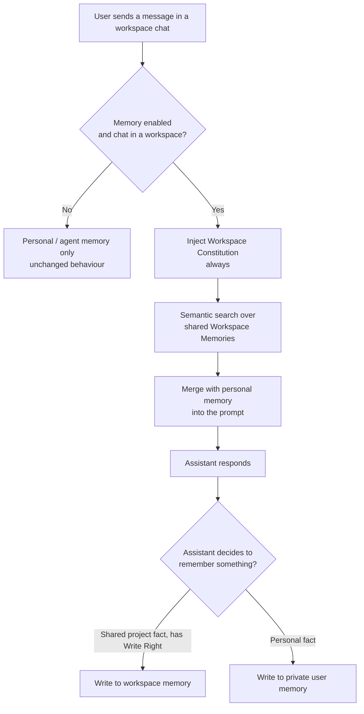

# Workspace Memory Architecture

## Overview

**Workspace Memory** adds a third memory scope to the PrimeThink memory system, alongside the two existing scopes:

| Scope | Belongs to | Visible to |
|-------|-----------|-----------|
| **User (global)** | a single user | that user, across every agent |
| **Agent** | a single user + a specific agent | that user, only through that agent |
| **Workspace** *(new)* | a [shared workspace](/Collaboration/#shared-workspaces) | **every member of the workspace** |

The goal is a **shared team brain**. Without it, two problems exist:

1. **Cross-project leakage** — a fact taught inside one project becomes a user-global memory and resurfaces in unrelated chats.
2. **No shared knowledge** — when a workspace is shared across several people, each member's assistant learns project facts independently and nothing is shared.

Workspace memory is keyed to the workspace and shared across all of its members, so the whole team benefits from the same learned project knowledge and rules, without polluting anyone's personal memory.

The feature is **additive**. Existing user and agent memory behave exactly as before, and no existing memory needs to change. It reuses the same tool-driven model described in the [Memory guide](/Memory/): the assistant decides when to remember and recall through its `search_memory` and `update_memory` tools — there is no background extraction process.

---

## When workspace memory is active

Workspace memory engages only when **all** of the following are true for a chat:

1. Memory is enabled for the chat (the assistant has the `MEMORY` [capability](/admin/Capabilities/) and the chat has memory turned on).
2. The chat belongs to a **workspace** (it lives inside a workspace container rather than being a standalone chat).
3. The chat is **not** a temporary chat.

When a chat does **not** belong to a workspace, none of the workspace behaviour runs and memory works exactly as it does today — pure personal/agent memory, with no behavioural change. This fallback is silent and never produces an error.

---

## Memory types

Workspace memory introduces two new memory types, mirroring the personal *Constitution* / *Other Important Memories* split:

| Type | Purpose | Loaded into the prompt? |
|------|---------|-------------------------|
| `workspace_constitution` | Behaviour rules every member's assistant must follow inside the workspace | **Always**, when the chat is in a workspace |
| `workspace_memory` | Shared project facts and context | On demand, via semantic search |

Both types are **agent-agnostic** — they are shared no matter which agent a member uses inside the workspace.

### Attribution vs. scope

A workspace memory records **who authored it** for attribution only. Its *scope* — who can see and use it — is the workspace, not the author. Any member sees every workspace memory regardless of which member created it.

---

## Permissions

### Reading

Read access is **implied by membership**. If a user can open a chat that belongs to a workspace, that user is a member of the workspace and may read its workspace memory. There is no separate read check.

### Writing (Write Right)

The right to **add, update, or delete** workspace memory follows the workspace's `share_type` (see [Shared Workspaces](/Collaboration/#shared-workspaces)):

| Workspace share type | Who can write workspace memory |
|----------------------|--------------------------------|
| `Shared` | **Every member** |
| `Owner Only` | The workspace creator only |
| `View Only` | The workspace creator only |
| `Not Shared` | The workspace creator only |

The rule is simple: in a fully `Shared` workspace, ownership is dissolved and everyone is equal, so everyone can curate the shared brain. In every other case, only the creator can change it, while other members can still read it.

When a member lacks Write Right:

* The workspace memory types are **not offered** to that member's assistant, so it will not attempt to write them.
* Any add / update / delete of a workspace memory is **rejected** without modifying anything.

### Ownership checks on update and delete

When the assistant updates or deletes a workspace memory, the system verifies that:

* the memory actually belongs to the **current** workspace, and
* the acting member holds **Write Right**.

If either check fails, the operation returns a not-found / not-permitted result and **no change is made**. This prevents a chat in one workspace from reaching into another workspace's memory.

---

## Retrieval and prompt injection

When a chat belongs to a workspace and memory is enabled:

1. **Workspace Constitution** memories are **always** injected into the assistant's system prompt, so the team's rules are in force from the first message.
2. The user's query is run through a **semantic search** over the workspace's shared knowledge, and relevant hits are injected.

Workspace memories appear in their own clearly labelled blocks, kept distinct from personal memory blocks, and their text is escaped so stored content cannot break out of its block in the prompt. From the assistant's side, calling `search_memory` inside a workspace transparently returns matches from **both** the user scope and the workspace scope, merged into one result set.

---

## Routing: how a write lands in the right scope

The scope of a write is determined by the **memory type** the assistant chooses:

* A **workspace type** (`workspace_constitution` / `workspace_memory`) routes the write to the workspace's shared memory — but only if the member holds Write Right. Otherwise the write is refused.
* A **personal type** routes to the user's private memory exactly as before.

For updates and deletes, routing is decided by the **stored** memory: if the target memory is a workspace memory, the workspace ownership and Write Right checks apply; otherwise the usual personal/agent checks apply.

This is why the leakage safeguard matters: the **type descriptions** the assistant reads explicitly state that workspace types are shared with everyone and that personal facts must stay in private memory. This guidance — not a structural barrier — is the primary control that keeps personal information out of the shared scope, exactly as agent-scoped rules are kept distinct from user-wide rules today.

---

## Supersession: memory as a history, not a cell to overwrite

A memory is never silently rewritten when the fact behind it changes. Each row carries a **status**:

| Status | Meaning |
|---|---|
| `active` | The current statement. This is what retrieval, page summaries and the assistant work from. |
| `superseded` | A statement that was true once and has since been replaced. Kept as history. |

A superseded row points at the memory that replaced it and records when, and optionally why, the change happened. This produces a flat chain: every superseded row points directly at the currently active statement, so reading history is a single query rather than a walk.

**What each operation does**

| Operation | Effect on history |
|---|---|
| Change a memory's **text** | The old row becomes `superseded` and a new `active` row carries the new statement. |
| Change only a memory's **priority** | Edited in place. No history row is created — a priority change is not a change of fact. |
| **Merge** during synthesis | Housekeeping: history belonging to the merged-away rows is re-pointed at the surviving result, so no chain is orphaned. |
| **Delete** ("forget") | A hard delete. The row **and its history** are removed. This is the only operation that destroys the trail. |

**Retrieval.** Superseded rows are excluded by default everywhere — listings, semantic search, prompt injection and page summaries. They are never injected as standalone facts, because a replaced statement asserted on its own is simply wrong. They surface in two ways only: as a dated one-hop note attached to the statement that replaced them (`[previously, until DATE: "…"]`), and through a deliberate history lookup or an explicit request to include them.

**Retention.** Superseded rows that have aged past the retention window without being recalled are hard-deleted by the nightly job, which keeps the history bounded. The default window is 365 days and is set per deployment.

### Rule provenance

The memory types that install a standing rule — `constitution`, `ai_personal`, `agent_constitution` and `workspace_constitution` — are treated as trusted input in every subsequent conversation, which makes them the highest-value target for prompt injection. Saving or changing one therefore requires a **verbatim quote from the user's own message**: the assistant must supply the words that state the rule, and they are checked against the message the user actually wrote, normalised for case and punctuation and subject to a minimum length.

A rule that can only be sourced from a document, a web page, an image or a tool result fails this check and is refused. Content the user merely shared with the assistant cannot install a rule; only content the user authored can. Non-rule memory types are unaffected.

### REST surface

Against `/api/v1/memories`:

| Endpoint | Purpose |
|---|---|
| `GET /` and `GET /search` | Accept `include_superseded` (default `false`). Leave it off for current state; turn it on to see the history alongside it. |
| `GET /{id}/history` | The rows a memory replaced, most recently replaced first. Empty for a memory that never changed. |
| `POST /{id}/supersede` | Replace a memory with a new statement, keeping the old one as history. Takes the replacement `text`, and optionally a `priority` and a `reason`. Returns the new memory. Contrast with `PUT /{id}`, which edits in place and creates no history. |

Memory payloads carry four supersession fields: `status`, `superseded_by_id`, `superseded_at` and `supersession_reason`. Read access to history follows the same rule as reading the memory itself — authorship for personal memories, workspace access for shared ones — and superseding requires the same write rights as editing.

---

## Lifecycle and maintenance

* **Pages** — memories are grouped into named pages, one per subject, within categories (`you`, `topic`, `area`, `people`, plus any a group adds). Atomic memories stay the source of truth: a page is a view over the memories filed under it, and a page is never embedded or retrieved as a unit. A page carries a derived `summary`, a `summary_stale` flag, and a user-owned `notes` field that synthesis never touches. Personal pages are scoped to a user; shared pages are scoped to a workspace, and are removed with it.
* **Nightly synthesis** — a scheduled job maintains each user scope and then each workspace scope: it files memories that have no page yet, merges pages that describe the same entity, removes near-duplicate bullets, resolves contradictions by freshness — superseding the outdated bullet rather than deleting it — applies decay to generic memories, rebuilds the summaries of pages whose bullets changed, deletes pages left empty, and retires supersession history that has aged past the retention window. Routing happens in this batch rather than at write time, so a memory written during the day is searchable and injected immediately but unfiled until the next run.
* **Prompt placement** — the stable part of memory (profile and preference pages, the agent constitution, workspace pages, and an index of page titles) is injected with the other per-chat-stable context, while query-dependent recalled memories are injected at the tail of the system prompt. Keeping the volatile block last stops it invalidating the cacheable prefix in front of it.
* **Managing pages** — pages and categories are readable and writable over the API (list, create, read, update, delete, and an explicit summary rebuild), scoped to the caller's user or workspace. Summaries are derived, so write to bullets and let a rebuild produce the summary rather than storing prose in it.
* **Deletion** — when a workspace is deleted, its workspace memories are removed with it, and the shared knowledge store for that workspace is cleared so no orphaned data remains.
* **Reindexing** — a workspace's shared knowledge can be rebuilt from its stored memories if search results ever drift, mirroring the personal-memory reindex described in the [Memory guide](/Memory/#viewing-and-managing-memories).

---

## Tenant isolation

Workspace memory preserves PrimeThink's hard tenant boundary: shared knowledge is always partitioned by both the workspace **and** the owning [Group (Organization)](/admin/Group-Management/). No memory is ever readable across organizations.

---

## Summary

* Workspace memory is a **third scope** — shared across all members of a workspace — added without touching personal or agent memory.
* It uses **two new types**: `workspace_constitution` (always injected) and `workspace_memory` (semantic recall).
* **Read** access follows membership; **write** access follows the workspace `share_type` (everyone in `Shared`, creator-only otherwise).
* Personal information is kept out of the shared scope by the instructions the assistant follows, the same way agent rules are kept separate from user rules.

See also: [Memory](/Memory/) · [Collaboration](/Collaboration/) · [Roles and Permissions](/admin/Roles-and-Permissions/)
